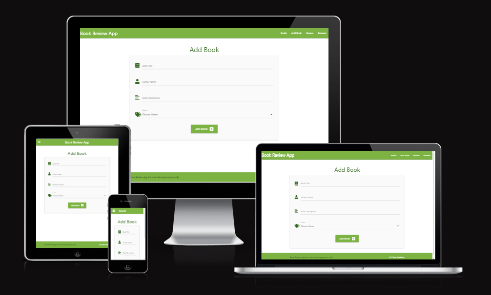
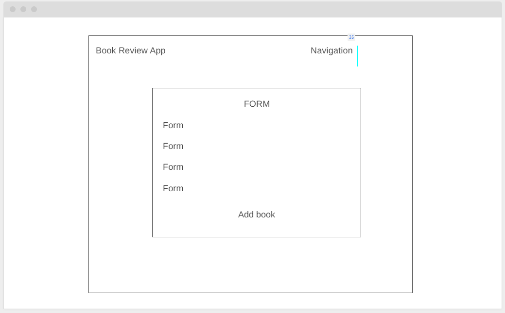
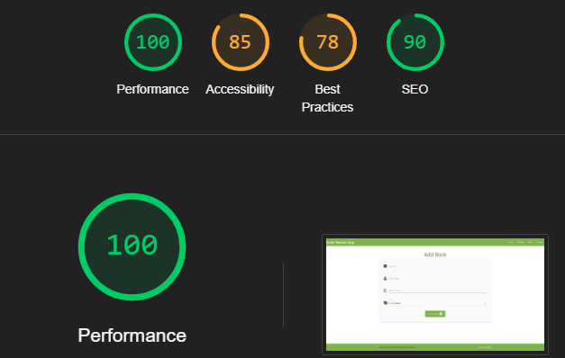
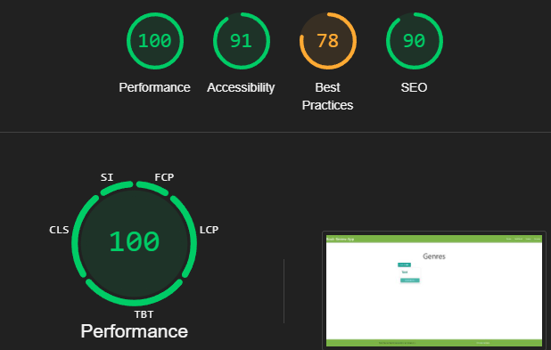
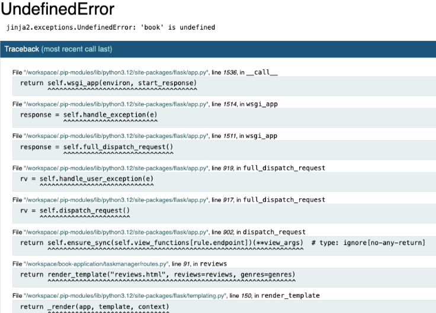
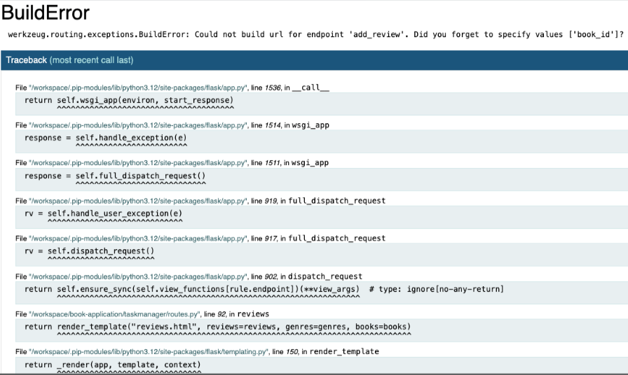
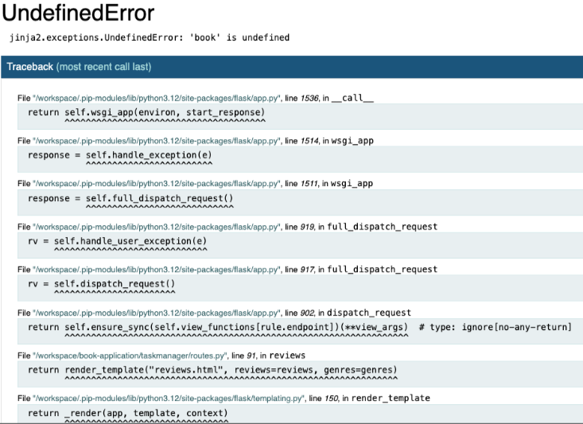

# Book Review App
## A website built to review your favourite books.
## - Ramil Jose Tyrone Tuazon

## [Live site](https://book-review-app-1f914f440823.herokuapp.com)

## [Repository](https://github.com/Ramil96/book-application)

## Table of contents

1. [UX](#ux)
2. [Features](#features)
3. [Future features](#future-features)
4. [Technology used](#technology-used)
5. [Testing](#testing)
6. [Bugs](#bugs)
7. [Deployment](#deployment)
8. [Credits](#credits)
9. [Content](content)
10. [Acknowledgements](#acknowledgements)

## UX

### Pre-project planning
> When embarking on this project, I wanted to create a website that helps the user add books and reviews to a website. I wanted to create a simple place for a user to be able to write what they want about a book, select its genre and add a rating as well as write, edit, read and delete reviews and books if desired. I wanted this project to have a simplistic feel so easy navigation was necessary and the use of simple warm colours like green and white.

## UX Design

### Strategy Plane
---
To determine the best approach to this project, I began by identifying and understanding both user and business needs. By focusing on these needs, I could ensure that the website would be functional, user-friendly, and aligned with simplistic book-review application goals.

## User Stories
### User
> As a user I want to be able to add a genre to make sure they fit the desired book I wanted to add.

> As a user I want to be able to be able to see other books and reviews.

> As a user I want to be able to write reviews for a book.

> As a user I want to be able to edit and delete my review.

> As a user I want to be able to rate books to my liking.

### Business Owner
> As the site owner I want to be able to showcase my simplistic style to users.

> As the site owner I want users to navigate the site easily.

> As the site owner I want to provide a place for my users to edit and delete their own reviews.

## Scope Plane
> The website should have a navigation menu that is consistent across all pages and devices.

> The website should give users a variety of different options for CRUD functionality.

> The website should make it easy for users to navigate.

> The website should include a reviews navigation button to see other reviews.

## Structure Plane
> To achieve the goals of the above the website will inclide at least 4 pages consisting books, add book, genres and reviews.

#### Home Page
> Navigation with links consistent across all pages.

> Books will be displayed on the home page as well as full naviation to all other pages.

#### Add Book
> This page will give the user the ability to add books rate them and add a description of the book.

#### Genres
> This page will give the user the ability to add genres to fit the specific books.

#### Reviews
> This page will give users the ability to write reviews and see reviews.

### Home Page desktop Wireframe

> The design flow of this website is meant to showcase a minimal design.

## Surface Plane

### Color

> I decided that the best approach to this website was a structured yet minimalistic design to bring light to the most important navigation links at the top of the page to influence direct access and information regarding ease of access functionaity for the use of CRUD functionality for this book application.

> The decision I took in terms of which colors were to be used were
> - #green - Materialize green

### Typography 
> The font's chosen for this project were 
- Default

> The reason I used this font were to keep the text simple and easy to read with no distractions.

## Features

### books.html

#### Header Navigation Features

> Navigation Bar and header developed using materialize.

#### Add review section 

> The design for this was created with simplicity to make sure it is clear for users to add reviews.

#### Reviews

> I wanted a straight to the point simple section for users to read their own and existing reviews on the site.

#### Add book 

> I wanted to create a simple way for users to add books to the database.

#### Genres

> This page is for genre creation and gives the user the ability to view books in specific genre tabs through clickable links.

## Future Features

### Home page
> I would like to add functionality to the sort method on the homepage books.

### Add book review
> I would like to give users the ability to add reviews alongside the book they add to the database.

## Technology Used 

#### HTML
> I used HTML to structure my project.

#### CSS and materialize
> I used CSS to style my project and adjust the layout of certain elements on my website.

## Testing
> Testing on this project was done manually by me by myself and family members to determine the functionality of the site with both usability and responsiveness to make sure it is easily usable by a new user.

#### Testing links and form

| Test                                                         | Outcome |
|--------------------------------------------------------------|---------|
| All links on Navigation lead to their correct pages.         | Pass    |
| User prevented from submitting form without correct elements.| Pass    |
| Reviews displayed when after submitting the book review.     | Pass    |

#### Testing responsiveness

| Test                                                         | Outcome |
|--------------------------------------------------------------|---------|
| Home page, about, prices, contact us displays correctly on screens larger than 950px  | Pass    |
| Home page, about, prices, contact us displays correctly on screens smaller than 950px | Pass    |

### User testing
#### User testing challenge
> 5 users are given some basic tasks prior to visiting web page and the results totaled to give result (20% per successful user result.)

| Test                                                         | Outcome |
|--------------------------------------------------------------|---------|
| Upon arrival to website please navigate to where you would expect to find a review form.  | 100%    |
| Please navigate to add a book.                                                            | 100%    |
| Please fill in the add book form.                                                         | 100%    |
| Please navigate to add a review.                                                          | 100%    |
| Please add a book review.                                                                 | 100%    |

#### User responsive testing
> 5 users were asked to view the website on their mobile devices and/or tablets to provide any feedback on errors or page overlapping issues.

| Test                                                         | Result |
|--------------------------------------------------------------|---------|
| Issues Reported         | None    |

## Google Lighthouse Testing 
### books

### add book

### genres

### add review

## HTML Validation

### index.html

#### Result: No Errors

### add_book.html

#### Result: No Errors

### genres.html

#### Result: No Errors

### reviews.html

#### Result: No Errors

## CSS Validation 

#### Result: No Errors for actual css although the error comes form materialize library and not my code.

## Bugs

> Site non functional. Fixed - Undefined error book is undefined. Defined string to books.html.

> Site non functional. Fixed - routes for add_review fix.

> Site non functional. Fixed - modify review routes. 

## Deployment
> To deploy the project I followed the steps on the heroku part of the project material. [here](https://github.com/Ramil96/book-application)

## Credits

## Content and Resources 

### w3 schools
> Used for general help for HTML AND CSS syntax.

### materialize
> Used for help regarding the responsive side of development.

### stack overflow 
> For help with general quiries in regards to CSS, HTML and python.

### Code Institute 
> Project created in line with course content and within project 3 scope.

## Acknowledgements 
### Rory Patrick
> My mentor who provided me with constructive feedback and positive reinforcement where applicable.
